# 🅿️ Documentação Completa do Sistema de Estacionamento (Para Estagiários e Devs)

Bem-vindo(a) ao guia completo do **Parking System**. Este documento foi projetado para te pegar pela mão e explicar **cada engrenagem** deste sistema. Se você está chegando agora, leia com atenção: ao final, você entenderá exatamente como o código se conecta e como a API funciona.

Usamos **Python 3.13**, **FastAPI**, **PostgreSQL** e **Docker**. Toda a arquitetura foi desenhada usando **Clean Architecture** e princípios **SOLID**.

---

## 🏛️ Diagrama de Classes Completo

O diagrama abaixo mostra **todas as camadas** do nosso sistema: as Entidades (mundo real), os Serviços (ações), as Estratégias (cobrança) e os Repositórios (banco de dados).

```mermaid
classDiagram
    %% ==========================================
    %% DOMÍNIO: Entidades e Enums
    %% ==========================================
    class VehicleType {
        <<enumeration>>
        CAR
        MOTORCYCLE
        TRUCK
    }

    class SpotType {
        <<enumeration>>
        COMMON
        ELDERLY
        PCD
        MOTORCYCLE
    }

    class Vehicle {
        +String id
        +String plate
        +VehicleType vehicle_type
        +__post_init__()
        -_validate()
    }

    class ParkingSpot {
        +String id
        +String spot_number
        +SpotType spot_type
        +Boolean occupied
        +occupy()
        +release()
        +is_available()
    }

    class Ticket {
        +String id
        +String vehicle_plate
        +String parking_spot_id
        +datetime entry_time
        +datetime exit_time
        +Decimal amount
        +close(exit_time, amount)
        +is_closed()
        +duration_in_hours()
    }

    class MonthlyCustomer {
        +String id
        +String name
        +String plate
        +Boolean active
        +activate()
        +deactivate()
    }

    %% ==========================================
    %% DOMÍNIO: Estratégias de Cobrança (Strategy)
    %% ==========================================
    class BillingStrategy {
        <<interface>>
        +String name
        +calculate(duration_hours: float) Decimal
    }
    class HourlyBilling {
        -Decimal _price_per_hour
        +calculate(duration_hours) Decimal
    }
    class FixedBilling {
        -Decimal _fixed_amount
        +calculate(duration_hours) Decimal
    }
    class DailyBilling {
        -Decimal _price_per_day
        +calculate(duration_hours) Decimal
    }
    
    BillingStrategy <|.. HourlyBilling
    BillingStrategy <|.. FixedBilling
    BillingStrategy <|.. DailyBilling

    %% ==========================================
    %% DOMÍNIO: Interfaces de Repositório (DIP)
    %% ==========================================
    class IVehicleRepository {
        <<interface>>
        +save(Vehicle) Vehicle
        +find_by_plate(String) Vehicle?
    }
    class IParkingSpotRepository {
        <<interface>>
        +find_available_by_type(SpotType) ParkingSpot?
        +lock_available_by_type(SpotType) ParkingSpot?
        +save(ParkingSpot) ParkingSpot
    }
    class ITicketRepository {
        <<interface>>
        +find_open_by_plate(String) Ticket?
        +save(Ticket) Ticket
    }
    class IMonthlyCustomerRepository {
        <<interface>>
        +find_by_plate(String) MonthlyCustomer?
        +save(MonthlyCustomer) MonthlyCustomer
    }

    %% ==========================================
    %% APLICAÇÃO: Serviços (Casos de Uso)
    %% ==========================================
    class EntryService {
        -IParkingSpotRepository _spots
        -ITicketRepository _tickets
        -MonthlyCustomerService _monthly
        +register_entry(Vehicle, SpotType?) Ticket
    }
    class ExitService {
        -IParkingSpotRepository _spots
        -ITicketRepository _tickets
        -BillingService _billing
        -MonthlyCustomerService _monthly
        +register_exit(plate: String) Ticket
    }
    class BillingService {
        -BillingStrategy _strategy
        +calculate(duration_hours: float) Decimal
    }

    EntryService ..> IParkingSpotRepository : usa
    EntryService ..> ITicketRepository : usa
    ExitService ..> IParkingSpotRepository : usa
    ExitService ..> ITicketRepository : usa
    ExitService ..> BillingService : usa
    BillingService o-- BillingStrategy : delega para

    %% ==========================================
    %% INFRAESTRUTURA: Repositórios Concretos
    %% ==========================================
    class SQLAlchemyVehicleRepository
    class SQLAlchemyParkingSpotRepository
    class SQLAlchemyTicketRepository
    class SQLAlchemyMonthlyCustomerRepository

    IVehicleRepository <|.. SQLAlchemyVehicleRepository
    IParkingSpotRepository <|.. SQLAlchemyParkingSpotRepository
    ITicketRepository <|.. SQLAlchemyTicketRepository
    IMonthlyCustomerRepository <|.. SQLAlchemyMonthlyCustomerRepository
```



> **Como ler este diagrama?**
> A camada de Domínio (Entidades e Interfaces) fica isolada no topo. A camada de Aplicação (Serviços) usa as Interfaces de Repositório, mas não sabe como elas funcionam por baixo dos panos. A camada de Infraestrutura (embaixo) é quem realmente implementa a conversa com o banco de dados (SQLAlchemy). Isso é Inversão de Dependência na prática!

---

## 📡 Guia de Endpoints da API REST

A nossa API é a forma como os frontends (web, mobile, painel da cancela) falam com o sistema. Abaixo estão todas as rotas disponíveis e como usá-las.

> 💡 **Dica de Ouro:** Você pode testar e brincar com todos esses endpoints através de uma interface visual clicando em **http://localhost:8000/docs** no seu navegador, caso o Docker já esteja rodando.

### 🚗 1. Tickets (O Coração do Fluxo) — `/api/v1/tickets`

| Método | Rota | O que faz? (Explicação Estagiário-Friendly) |
| :--- | :--- | :--- |
| **POST** | `/entry` | **Registra a entrada de um veículo**. Você manda a Placa e o Tipo (Carro/Moto). O sistema verifica se é mensalista, acha uma vaga livre, "tranca" ela (`SKIP LOCKED` no banco), e devolve um Ticket Aberto. Se mandar o tipo de vaga, ele respeita; senão, escolhe automático. |
| **POST** | `/exit` | **Registra a saída**. Você manda só a Placa. O sistema acha o ticket aberto, calcula o preço (olhando a estratégia de cobrança ou zerando se for mensalista), fecha o ticket e libera a vaga física. |
| **GET** | `/open` | **Pátio atual**. Retorna uma lista com todos os tickets que ainda não têm hora de saída (ou seja, os carros que estão estacionados lá dentro agora). |
| **GET** | `/` | Retorna o histórico de **todos** os tickets que já existiram. |
| **GET** | `/{id}`| Puxa os dados de um único ticket pelo ID dele. |

---

### 🅿️ 2. Vagas de Estacionamento — `/api/v1/spots`

| Método | Rota | O que faz? (Explicação Estagiário-Friendly) |
| :--- | :--- | :--- |
| **POST** | `/` | **Cria uma vaga nova** no banco. Você passa o número (ex: "B-22") e o tipo (ex: "pcd"). |
| **GET** | `/` | Lista o mapa inteiro de vagas do estabelecimento (ocupadas e livres). |
| **GET** | `/available`| Mostra apenas as vagas que estão 100% livres e prontas para uso. |
| **GET** | `/{id}` | Busca os dados específicos de uma vaga. |
| **DELETE**| `/{id}` | Apaga uma vaga (só funciona se a vaga não estiver ocupada por um carro!). |

---

### 💳 3. Clientes Mensalistas — `/api/v1/monthly-customers`

| Método | Rota | O que faz? (Explicação Estagiário-Friendly) |
| :--- | :--- | :--- |
| **POST** | `/` | **Cadastra um mensalista**. Você informa Nome e Placa. O carro dessa placa agora passa livre (R$ 0,00) na saída. |
| **GET** | `/` | Lista todo mundo que já se cadastrou, pagantes atuais e devedores inativos. |
| **GET** | `/active` | Lista apenas a galera que tá com a mensalidade em dia e pode entrar de graça. |
| **PATCH**| `/{id}/activate` | Ativa o plano do cliente. A placa volta a ter 100% de desconto. |
| **PATCH**| `/{id}/deactivate`| Cancela ou suspende o plano. Se o cara entrar, vai ter que pagar por hora como qualquer pessoa normal. |
| **DELETE**| `/{id}` | Remove permanentemente o cadastro. |

---

### 🚙 4. Veículos (CRUD Simples) — `/api/v1/vehicles`

*(Nota: Na vida real do estacionamento, os veículos são criados automaticamente no fluxo de entrada. Este CRUD serve mais para manutenção administrativa do banco).*

| Método | Rota | O que faz? (Explicação Estagiário-Friendly) |
| :--- | :--- | :--- |
| **POST** | `/` | Cadastra um veículo de forma avulsa. |
| **GET** | `/` | Traz o registro de todas as placas que já visitaram o estacionamento. |
| **GET** | `/{id}` | Busca um veículo pelo ID. |
| **DELETE**| `/{id}` | Apaga um veículo do sistema. |

---

## 🏎️ Como a Entrada Evita Bater Carros Virtuais (`SKIP LOCKED`)

Quando programamos para web, dezenas de coisas podem acontecer ao mesmo tempo. 
Imagine que **duas catracas abrem exatamente no mesmo milissegundo** e ambos os motoristas apertam o botão de ticket. 

1. **O Problema Clássico:** 
   O sistema da Catraca 1 pergunta ao banco: *"Me dê a primeira vaga comum livre"*. O banco diz *"Vaga 1"*.
   O sistema da Catraca 2 pergunta a mesma coisa. Como a Catraca 1 ainda está processando a entrada, a Vaga 1 no banco ainda aparece como livre. O banco diz *"Vaga 1"*.
   **Boom! 💥 Duas pessoas são enviadas para a mesma vaga.**

2. **A Solução Elegante (`lock_available_by_type`):**
   Nós resolvemos isso na raiz do banco de dados (PostgreSQL) usando uma magia chamada `FOR UPDATE SKIP LOCKED`.
   - Quando a Catraca 1 pede uma vaga livre, ela **TRACA (lock)** aquela linha da Vaga 1 na mesma fração de segundo. 
   - Quando a Catraca 2 pede uma vaga 1 milissegundo depois, a query do banco tenta olhar para a Vaga 1, vê que ela está trancada, **PULA (skip)** para a linha de baixo (Vaga 2) e devolve a Vaga 2. Tudo em uma transação atômica indestrutível.

---

## 💸 Explicando a Estratégia de Cobrança (`BillingStrategy`)

Seu chefe vira pra você e diz: *"Final de semana que vem a cobrança não vai ser por hora. Vai ser um valor fixo de R$ 50 para qualquer carro"*.

Em códigos ruins, você abriria o arquivo que calcula preço e encheria de `if hoje == sabado`. Em códigos bons (Clean Architecture), nós usamos o **Strategy Pattern**.

*   O arquivo `billing_strategy.py` define uma **Interface** (`BillingStrategy`). Toda forma de cobrança tem que saber responder à pergunta: `calculate(horas)` e devolver um dinheiro.
*   Nós já deixamos pronto o `HourlyBilling` (por hora, o padrão da nossa API), o `FixedBilling` (valor único) e o `DailyBilling` (diárias longas).
*   Se quiser criar a cobrança de sábado, basta criar a classe `SabadoBilling(BillingStrategy)` e injetá-la no `BillingService`. Sem mexer em um único arquivo de regra de negócio existente!

---

## 🐳 Cheatsheet do Desenvolvedor (Comandos)

Para você copiar e colar e não perder tempo.

**Ligar Tudo (Banco + API):**
```bash
docker compose up -d
```

**Parar Tudo:**
```bash
docker compose down
```

**Ver os logs em tempo real (se algo quebrou):**
```bash
docker compose logs -f api
```

**Rodar TODOS os testes automatizados garantindo que não quebrou nada:**
```bash
# Rodar com Docker:
docker compose --profile test run --rm tests

# Rodar localmente no seu terminal:
.venv/bin/python -m pytest
```

---
*Escrito com carinho pelo time de Engenharia. Quebre o código, conserte, aprenda!*
